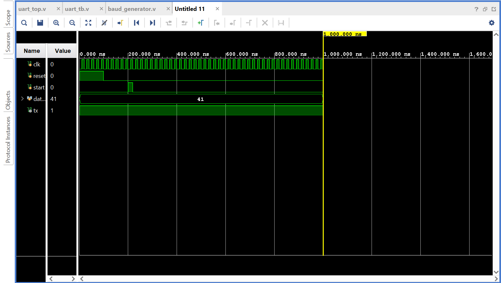

# UART Transmitter–Receiver System in Verilog

## Overview

This project implements a **Universal Asynchronous Receiver/Transmitter (UART)** communication system using **Verilog HDL** and simulated in **Xilinx Vivado**.

The design includes a **baud rate generator**, **UART transmitter**, **UART receiver**, and a **loopback testbench** that verifies correct transmission and reception of data.

UART is a widely used serial communication protocol for communication between microcontrollers, FPGAs, and computers.

---

## Project Features

* Verilog-based **UART transmitter**
* Verilog-based **UART receiver**
* **Baud rate generator** for serial timing
* **Loopback architecture** (TX connected to RX)
* **Behavioral simulation in Vivado**
* **Waveform verification**
* Modular RTL design

---

## Project Structure

```
uart_project
│
├── rtl
│   ├── baud_generator.v
│   ├── uart_tx.v
│   ├── uart_rx.v
│   └── uart_top.v
│
├── images
│   └── uart_tx_waveform.png
│
├── uart_project.srcs
├── uart_project.ip_user_files
│
├── README.md
└── uart_project.xpr
```

---

## System Architecture

The system is composed of the following modules:

### 1. Baud Generator

Generates timing ticks required for UART bit transmission.

```
Clock → Baud Generator → Baud Tick
```

---

### 2. UART Transmitter

Converts parallel data into serial UART format.

Frame structure:

```
Start Bit | Data Bits (8) | Stop Bit
    0           01000001        1
```

Example transmission for ASCII **'A' (0x41)**.

---

### 3. UART Receiver

Receives serial data and reconstructs the original 8-bit data.

Functions:

* Detect start bit
* Sample incoming data
* Reassemble received byte
* Assert `data_valid`

---

### 4. Top Module

Integrates all components.

```
          +----------------+
Clock --->| Baud Generator |
          +--------+-------+
                   |
                   v
           +-------+-------+
Data ----->| UART Transmit |
           +-------+-------+
                   |
                   v
                TX Line
                   |
                   v
           +-------+-------+
           | UART Receiver |
           +-------+-------+
                   |
                   v
               Received Data
```

---

## Simulation

Simulation was performed using **Vivado Behavioral Simulation**.

Testbench operations:

1. Reset the system
2. Load data (`0x41`)
3. Trigger transmission using `start`
4. Observe UART frame on `tx`
5. Verify received data

---

## Simulation Waveform

The waveform below shows the UART transmission and reception.



Key signals visible in the waveform:

* `clk`
* `start`
* `data`
* `tx`
* `rx_data`
* `data_valid`

---

## Tools Used

* **Verilog HDL**
* **Xilinx Vivado**
* **Git & GitHub**

---

## How to Run the Simulation

1. Open the project in **Vivado**
2. Navigate to:

```
Simulation → Run Simulation → Run Behavioral Simulation
```

3. Run the simulation for sufficient time:

```
run 2 ms
```

4. Observe signals in the waveform viewer.

---

## Learning Outcomes

This project demonstrates:

* Finite State Machine (FSM) design
* Serial communication protocols
* RTL hardware design using Verilog
* Simulation and debugging in Vivado
* Version control using Git

---

## Author

**Saksham**

GitHub: https://github.com/sakshammhere
